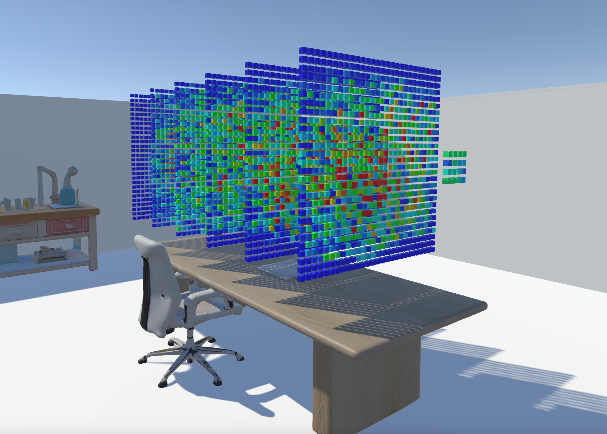
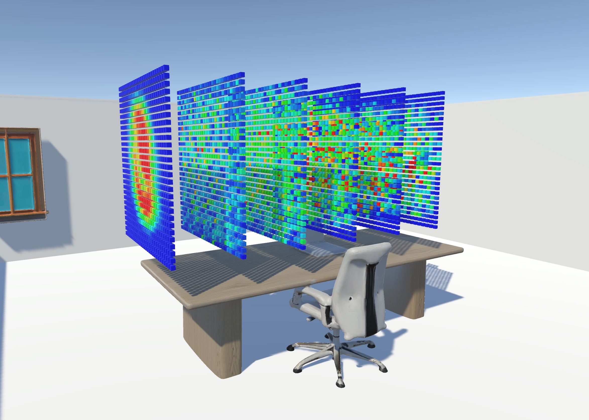

# Neural Network Visualization in Unity

This Unity project visualizes neural networks by loading JSON-based neural network data, positioning neurons in 3D space, and coloring them based on heat values. The `NetworkLoader` script orchestrates this visualization, creating a dynamic, adjustable neural network model in the Unity Editor.

## Table of Contents

- [Neural Network Visualization in Unity](#neural-network-visualization-in-unity)
  - [Table of Contents](#table-of-contents)
  - [Features](#features)
  - [Setup](#setup)
    - [Requirements](#requirements)
  - [JSON File Format](#json-file-format)
    - [JSON Fields](#json-fields)
  - [License](#license)

## Features

<div style="display: flex; justify-content: space-around;">
    
    
</div>


- **3D Visualization of Neural Networks**: Layers of neurons are organized in 3D space, with adjustable layer and neuron spacing.
- **Color Coding by Heat**: Neurons are color-coded based on their heat values, ranging from blue (cooler) to red (hotter).
- **Dynamic Scaling**: The network scales to fit within a defined maximum depth, maintaining visual clarity regardless of network size.
- **Customizable Parameters**: Adjust layer spacing, width, and neuron prefab properties directly from the Unity Inspector.

## Setup

1. Clone or download this repository.
2. Open the project in Unity.
3. Import the required JSON file format and a neuron prefab to represent individual neurons.

### Requirements

- Unity 2020.3 or higher.
- Basic understanding of Unity's Inspector and Scene settings.

## JSON File Format

Each neural network is defined in a JSON format, which includes details about layers and neurons. Here’s an example structure:

```json
{
  "layers": [
    {
      "neurons": [
        {
          "id": 1,
          "position": [0.5, 0.2],
          "heat": 100
        },
        {
          "id": 2,
          "position": [0.7, 0.1],
          "heat": 200
        }
      ]
    },
    {
      "neurons": [
        {
          "id": 3,
          "position": [0.3, 0.8],
          "heat": 500
        }
      ]
    }
  ]
}
```

### JSON Fields

- **`layers`**: Array of neural layers, each containing multiple neurons.
- **`neurons`**: Array of neuron objects within a layer.
  - **`id`**: Unique identifier for each neuron.
  - **`position`**: `[x, y]` position coordinates of the neuron within its layer.
  - **`heat`**: Heat value affecting the neuron's color intensity.

## License

This project is licensed under the MIT License. Feel free to modify and use it for personal or commercial purposes.